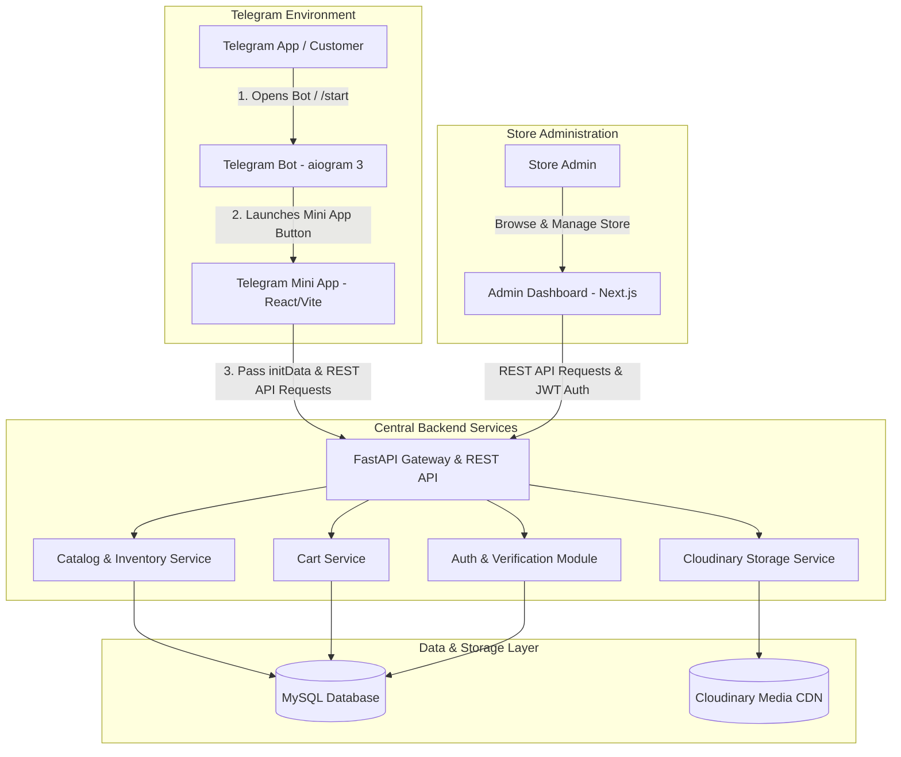
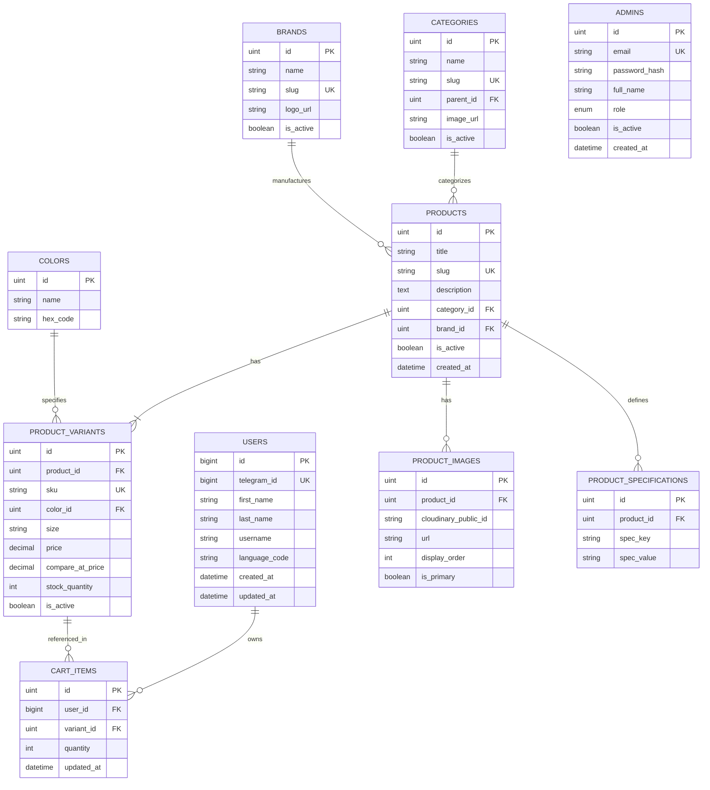
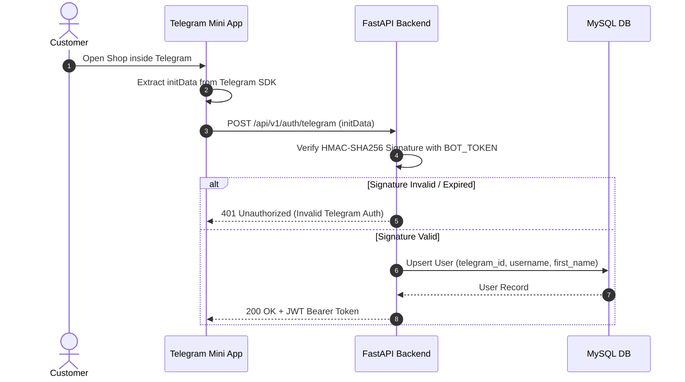

# System Architecture & Detailed Specification: Mela Shop

## 1. Executive Summary

**Mela Shop** is an e-commerce platform integrated into Telegram via a **Telegram Mini App (TMA)** for customers, paired with a modern **Admin Dashboard** for store management, powered by a **FastAPI** backend microservice architecture and a **MySQL** relational database.

### Core Architecture Highlights
* **Customer Entrypoint**: Telegram Bot (`aiogram 3`) triggering a Telegram Mini App (`React` + `Vite` + `Telegram Mini App SDK`).
* **Store Owner Management**: Next.js 14+ (`App Router`) + `shadcn/ui` web dashboard.
* **Central API & Logic Engine**: FastAPI (Python 3.12+) with SQLAlchemy 2.0 async ORM, Alembic migrations, and Pydantic v2 validation.
* **Media & Asset Engine**: Cloudinary for optimized image storage, transformations, and global CDN delivery.
* **Data Persistence**: MySQL 8.0+ with normalized 3NF schema, transactional integrity, and index-optimized query layers.

---

## 2. High-Level System Architecture

---

## 3. Subsystem Deep Dive

### 3.1 Telegram Bot (`bot/`)
* **Technology**: Python 3.12+, `aiogram 3.x`, `httpx`
* **Role**: Primary onboarding trigger for customers.
* **Responsibilities**:
  - Listen for `/start` and deep links.
  - Render dynamic inline keyboard with the `WebAppInfo` button pointing to the Telegram Mini App deployment URL.
  - Provide basic shop informational commands (`/help`, `/about`, `/support`).
  - Validate bot health and webhooks.

### 3.2 Telegram Mini App (`miniapp/`)
* **Technology**: React 18/19, TypeScript, Vite, Tailwind CSS, `@telegram-apps/sdk-react` (or `@twa-dev/sdk`), TanStack Query v5, Zustand, Axios, Zod.
* **Role**: High-performance, mobile-native shopping catalog running inside Telegram.
* **Key Features (V1)**:
  - **Catalog Browsing**: Categories, brand filters, search with client-side debouncing, and pagination.
  - **Product Showcase**: Dynamic image carousel (Cloudinary optimized), variant selector (sizes/colors), spec table.
  - **Cart Management**: Add/remove items, quantity adjustments, persistent client + backend cart sync.
  - **User Profile**: Display Telegram user details, order history placeholder (V2 ready).
  - *Non-Scope for V1*: No checkout, no payment gateway, no product reviews or ratings.

### 3.3 FastAPI Backend (`backend/`)
* **Technology**: Python 3.12+, FastAPI, SQLAlchemy 2.0 (Async Engine + PyMySQL/aiomysql), Pydantic v2, Alembic, Uvicorn, HTTPX.
* **Role**: Secure API engine serving both Mini App & Admin Dashboard.
* **Core Responsibilities**:
  - **Telegram Auth Verification**: HMAC-SHA256 verification of Telegram `initData` string using Bot Secret Key.
  - **Admin Security**: Argon2id password hashing, JWT access token generation and authorization guard middleware.
  - **Catalog Logic**: Hierarchical category tree, brand management, product variants with dynamic stock validation.
  - **Cart Engine**: Atomic DB mutations for cart state per customer.
  - **Cloudinary Integration**: Dynamic signature generation for direct/backend image uploads to Cloudinary.

### 3.4 Admin Dashboard (`admin/`)
* **Technology**: Next.js 14+ (App Router), React, TypeScript, Tailwind CSS, `shadcn/ui`, TanStack Query v5, React Hook Form, Zod, Axios.
* **Role**: Internal web portal for shop operations.
* **Key Features**:
  - **Metrics Overview**: Summary stats (total products, active categories, total registered users, low-stock alerts).
  - **Product Builder**: Multi-step product manager with variant builder (attributes, colors, sizes, pricing), image drag-and-drop uploader.
  - **Category & Brand Management**: Parent-child category nesting, brand logos, active/inactive toggles.
  - **Inventory Control**: Real-time stock quantity updates per variant.
  - **Customer Registry**: Searchable customer list imported from Telegram auth logs.

---

## 4. Database Schema Design (3NF)

---

## 5. Security & Authentication Architecture

### 5.1 Telegram Mini App `initData` Validation Flow
1. Mini App retrieves `window.Telegram.WebApp.initData` raw query string.
2. Sent to `POST /api/v1/auth/telegram/login` in `Authorization` header or payload.
3. FastAPI computes `HMAC-SHA256(hash_key, data_check_string)` where `hash_key = HMAC-SHA256("WebAppData", BOT_TOKEN)`.
4. Compares generated signature with `hash` parameter in `initData`.
5. If valid & timestamp is fresh (< 24 hrs), FastAPI extracts user info, upserts user in MySQL, and returns a scoped session JWT token.

### 5.2 Admin Authentication Flow
1. Store owner submits credentials to Next.js Admin login page (`POST /api/v1/admin/auth/login`).
2. Backend verifies email exists and verifies Argon2id password hash.
3. Returns short-lived JWT Access Token (15 min) + Refresh Token set in HTTP-Only, `SameSite=Strict` Cookie.

---

## 6. API Route Specification Blueprint

### 6.1 Customer / Mini App Endpoints (`/api/v1/miniapp`)
* `POST /auth/telegram`: Authenticate Telegram user via `initData`.
* `GET /categories`: Fetch hierarchical categories list.
* `GET /brands`: Fetch active brands.
* `GET /products`: Search & paginate product catalog (filters: category, brand, query, min/max price).
* `GET /products/{slug}`: Fetch single product details with all variants, colors, specs, and images.
* `GET /cart`: Fetch user's active cart with subtotal calculation.
* `POST /cart/items`: Add variant to cart.
* `PATCH /cart/items/{item_id}`: Update cart item quantity.
* `DELETE /cart/items/{item_id}`: Remove item from cart.
* `GET /users/me`: Fetch current logged-in user profile.

### 6.2 Admin Endpoints (`/api/v1/admin`)
* `POST /auth/login`: Admin login.
* `POST /auth/refresh`: Refresh JWT access token.
* `GET /dashboard/stats`: Retrieve catalog summary metrics.
* `GET /products`: List products (with full filters & stock status).
* `POST /products`: Create new product with variants, colors, specs.
* `PUT /products/{id}`: Update product details.
* `DELETE /products/{id}`: Soft-delete/deactivate product.
* `POST /media/upload`: Upload image to Cloudinary & record in DB.
* `DELETE /media/{image_id}`: Remove image from Cloudinary & DB.
* `GET /categories`: CRUD categories.
* `GET /brands`: CRUD brands.
* `GET /customers`: List registered Telegram customers.

---

## 7. Operational & Non-Functional Requirements

1. **Performance**: 
   - Mini App catalog queries cached or response time < 100ms.
   - Cloudinary auto-formats images (`f_auto,q_auto`) for optimal WebP/AVIF output on mobile devices.
2. **Scalability**: 
   - Database connection pool configured with SQLAlchemy (`pool_size=20`, `max_overflow=10`).
   - Stateless API enabling horizontal FastAPI scaling behind Nginx/Traefik reverse proxy.
3. **Data Integrity**: 
   - Strict FK relations with `ON DELETE RESTRICT` for products and categories.
   - Optimistic Concurrency Control (OCC) or atomic stock increment/decrement operations for inventory sanity.
